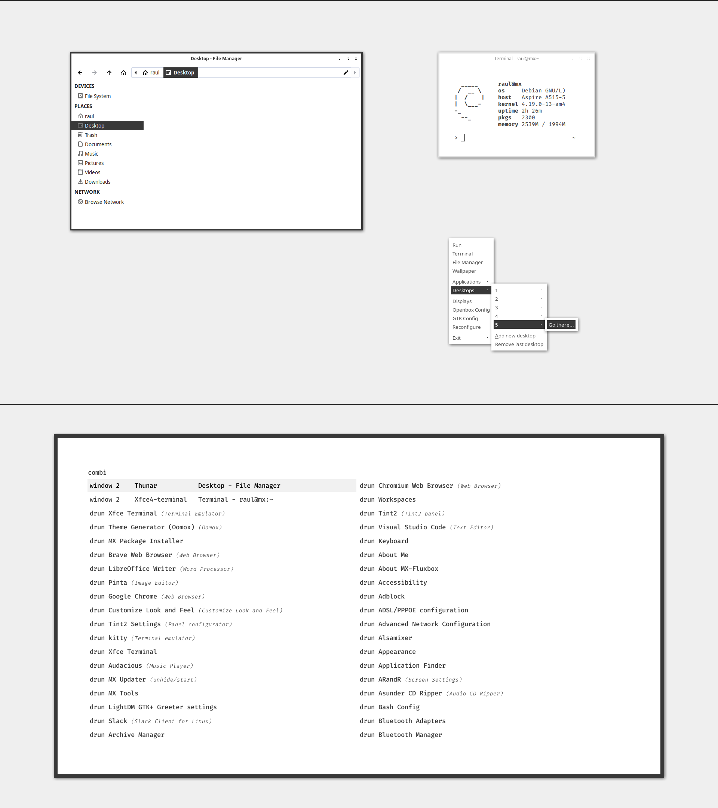

# Openbox Themes Collection

Most of them include on their own folder a Rofi theme too as it's my favourite windows switcher.

## High Minimal Contrast

An almost complete theme. Openbox + GTK2/3 + Rofi.

## Light Black

Openbox / GTK2/3 theme along a Rofi and Kitty Terminal Sonokai colorscheme, pretty much like High Minimal Contrast but the dark accent is different plus some GTK components are better managed (scrollbars, filechooser...)

